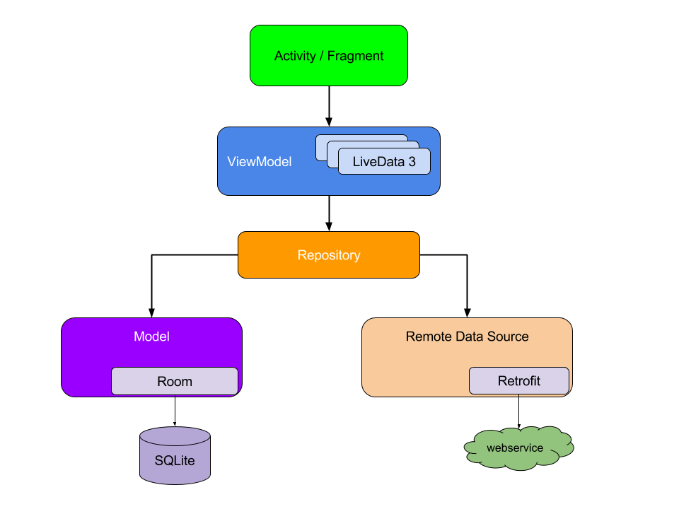

<h1>Weather App</h1>

A simple app to search and view the weather in the city you want. After searching, the 10 most recently searched cities will be saved.

<h1>Libraries</h1>
<ul>
  <li>Coroutines</li>
  <li>Flow</li>
  <li>Live Data</li>
  <li>Data bindings</li>
  <li>Retrofit2</li>
  <li>Room</li>
  <li>Shared Preferences</li>
  <li>Koin</li>
</ul>
<h1>Architecture</h1>

The app uses MVVM architecture

<h1>Outputs</h1>

